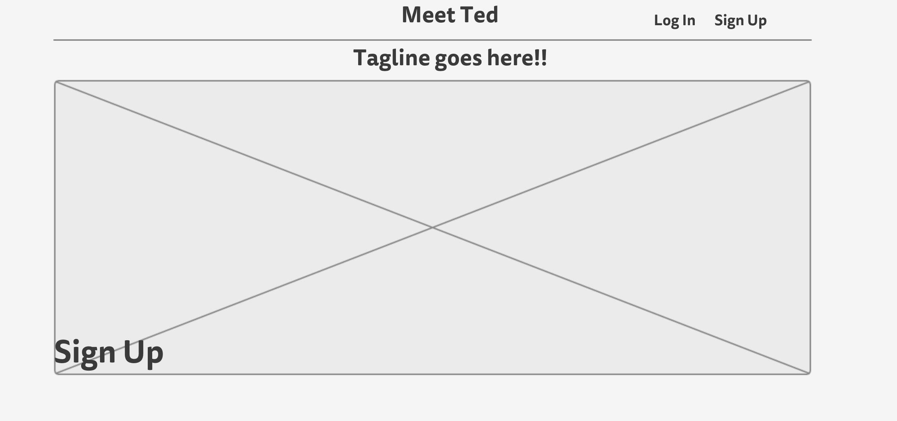
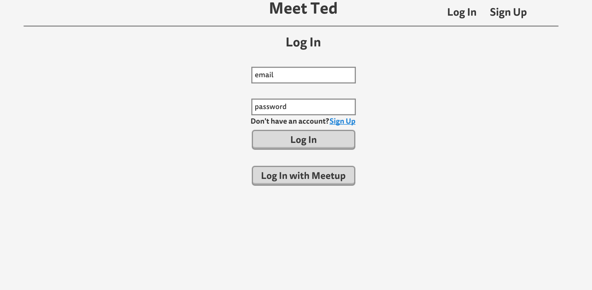
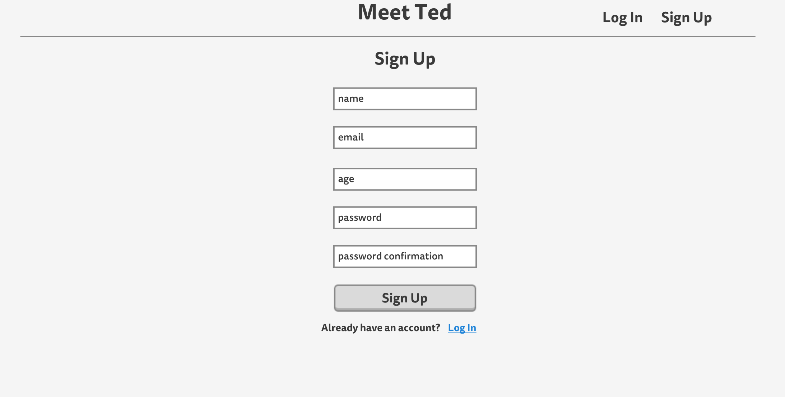
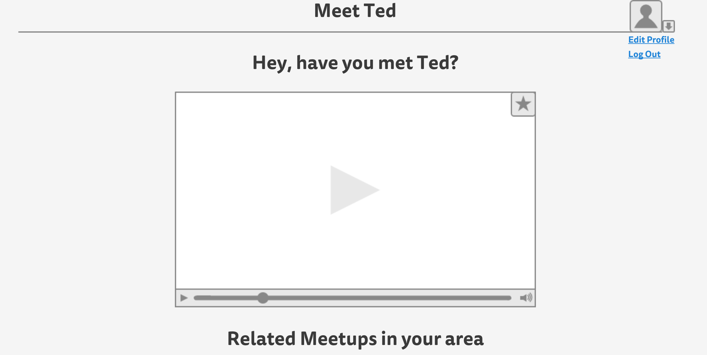

# WDIProject3
Present an idea to the instructors with a deck, covering the period of project inception, that includes:

The basic concept of the app is to use both YouTUBE and MEETUP apis to integrate their services into a single app.  We will display a random video, rather than allow users to choose their own, in an effort to expose users to ideas, and categories that they may not otherwise encounter.  Underneath the video we will provide a list of MEETUPs that are local to the user that match the topic of the TED talk.

##a list of included technologies
	- html
	- css
	- bootstrap
	- node.js
		- packages included:
		- 	express
		-  ejs
		-  mongoose
		-  flash
		-  morgan
		-  cookie-parser
		-  body-parser
		-  session
		-  passport
		-  passport-config
		-  passport-meetup

	- mongo DB
	- AJAX
	- Jquery
	- creating a single page application

##third-party APIs consumed
We are accessing the YouTUBE api to pull TED talks into our app, and MEETUP to pull meetups in the local area that match the category for the TED video viewed.

##OAuth provider for authentication
We will use passport and then Passport-Meetup to allow users to login with MEETUP if they have an account

##wireframes

##an underlying data model.
A user has many videos

User:
user info
Likes: ['video category', 'video category', 'video category', ...]
<- this is populated when a user likes a video, with that video's category

Video:
video info
category

##Document your app's RESTful API.
The User Schema

	- Local Login
		-name: String
		-email: String
		-password: String
		-location: Number *zip code*
		-likes: [ *each item is a video category the user has liked*]
	- Meetup Login
		-id: String
		-name: String
		-token: String
		-email: String
		-location: Number *zip code*

Video Schema

	-id: String
	-title: String
	-url: String
	-category: String
	-description: Text

##User Stories
- As a USER, I want to be able to sign up locally or through my meetup site
- As a USER, I want to view a random TED talk video each day to expand my mind
- As a USER *with an expanded mind*, I want to be able to pursue my new interests through related local MEETUP groups that are displayed below the video
- As the CREATORS of the site, we want to consume the TED and MEETUP apis
- As the CREATORS of the site, we want to gather information on users and their likes and dislikes and store them in our API
